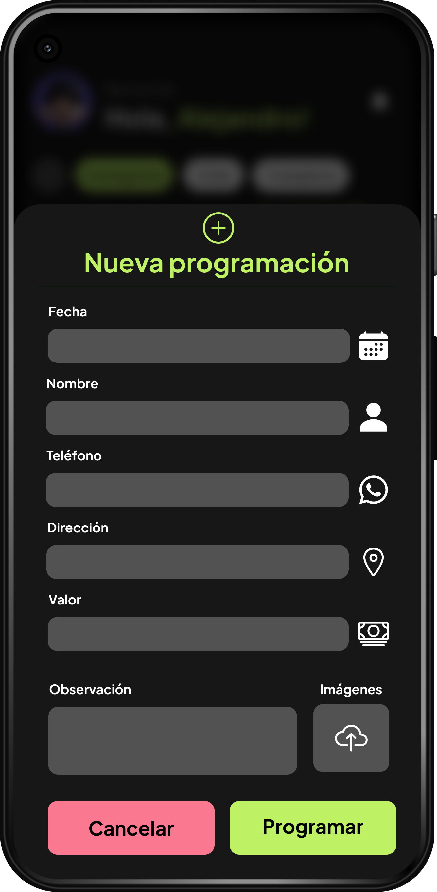
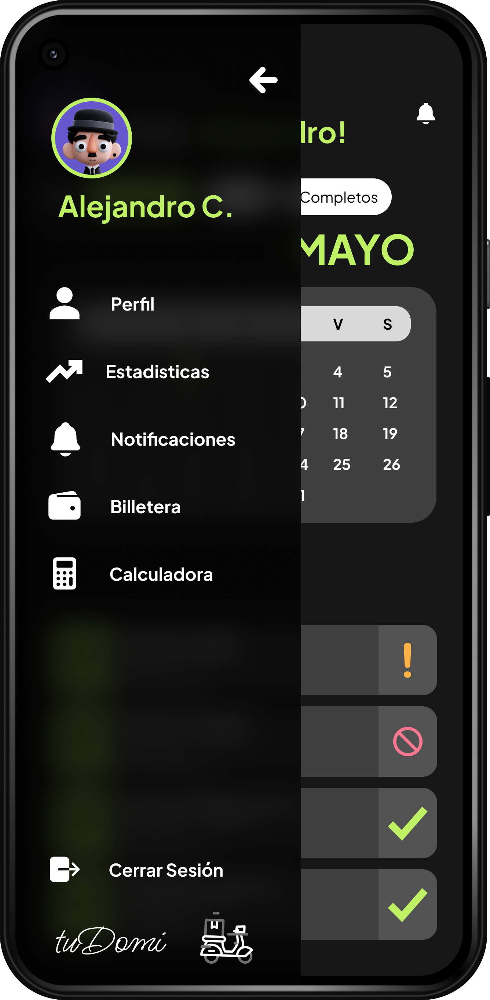

# Bienvenido a houseRental (ReactNative-Expo)

## Descripción
tuDomi es una aplicación móvil intuitiva y eficiente diseñada para facilitar la programación y realización de domicilios de una manera rápida y segura. Ya sea que necesites enviar un paquete, solicitar un servicio de mensajería o recibir productos de tus tiendas favoritas, DomiGo es tu aliado perfecto. Con solo unos pocos toques en tu dispositivo móvil, puedes gestionar todos tus envíos desde la comodidad de tu hogar u oficina.

## Características Principales
- **Exploración fácil**: Navega a través de una amplia gama de opciones de viviendas con un sistema de filtrado inteligente.
- **Interfaz amigable**
- Diseño Intuitivo: Navegación sencilla y accesible para usuarios de todas las edades.
- Proceso de Registro Rápido: Registro fácil mediante correo electrónico o redes sociales.
- **Gestión eficiente de propiedades**: Beneficios tanto para inquilinos como para propietarios.
- **Seguridad y confianza**: Verificación de identidad, evaluaciones de propiedades y pagos seguros.

## Capturas de Pantalla
|  **View de Login** |  **View de cronograma** |  **View de mas crear domicilio** |  **View de Domicilio** |
|---|---|---|---|
|  **View de menu** | | | |

## Instalación
1. Clona el repositorio: `git clone https://github.com/alekanDev/houseRental.git`
2. Instala las dependencias: `yarn install`
3. Inicia la aplicación: `yarn expo start`
   
**NOTA:** Antes de iniciar el front tener en cuenta haber realizado el proceso del back y asi tener completamente funcional la plataforma.

## Contacto
Para preguntas o sugerencias, no dudes en ponerte en contacto con nosotros en alekandev@gmail.com o a través de la sección de Problemas en este repositorio.

¡Gracias por tu interés en houseRental!
